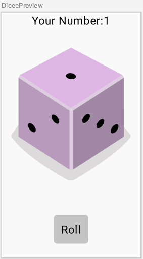

# Roll Dice

## Introcduction
This is very simple app using compose.
The app only provides one function which allows user to click button and change the dice image.

## Importance Point
### 1. How to save the state variable
* Using **remember** keyword and **mutableStateOf**
  ```kotlin
    // save the state by using remember keyword and mutableStateOf()
    val lastNumber = remember{
        mutableStateOf(1)
    }
    // use state value to update image resource
    val diceImageResource = when (lastNumber.value) {
        1->R.drawable.dice_1
        2->R.drawable.dice_2
        3->R.drawable.dice_3
        4->R.drawable.dice_4
        5->R.drawable.dice_5
        6->R.drawable.dice_6
        else->R.drawable.dice_1
    }
  ```

### 2. App UI
